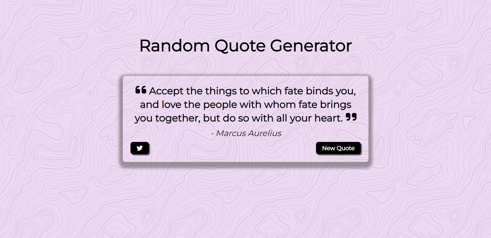

# Random Quote Generator

Welcome to the Random Quote Generator! This project allows you to generate random quotes. It is built using HTML, CSS, and JavaScript, and it utilizes a third-party API to fetch a collection of quotes.

## Live Demo

Check out the live demo of the project: https://jeffs0412.github.io/random-quote-generator/

## Features

- **Random Quote**: Click the "New Quote" button to generate a new random quote.
- **Tweet Quote**: Click the Twitter button to share the quote on Twitter.

## Technologies Used

- HTML: Used for structuring the web page.
- CSS: Responsible for styling the project and making it visually appealing.
- JavaScript: Implemented the functionality of the random quote generator.
- [type.fit API](https://type.fit/api/quotes): Used to fetch a collection of quotes.

The project also uses the Font Awesome library for icons.

## How It's Built

The random quote generator is built using HTML, CSS, and JavaScript. Here's a brief overview of the files and their functionality:

- **index.html**: Contains the HTML structure of the project.
- **style.css**: Defines the styles and layout of the random quote generator.
- **script.js**: Implements the functionality of generating random quotes by fetching data from the [type.fit API](https://type.fit/api/quotes).

## Usage

To use the Random Quote Generator, follow these steps:

1. Open the web page in your browser.
2. Click the "New Quote" button to generate a new random quote.
3. To share the quote on Twitter, click the Twitter button.

Feel free to click the "New Quote" button multiple times to generate different quotes.

## Contact

You can reach out to me through the following channels:
- Email: manalejefferson@gmail.com
- LinkedIn: [LinkedIn Profile](https://www.linkedin.com/in/jefferson-manale/)

Feel free to explore the project and get in touch!
